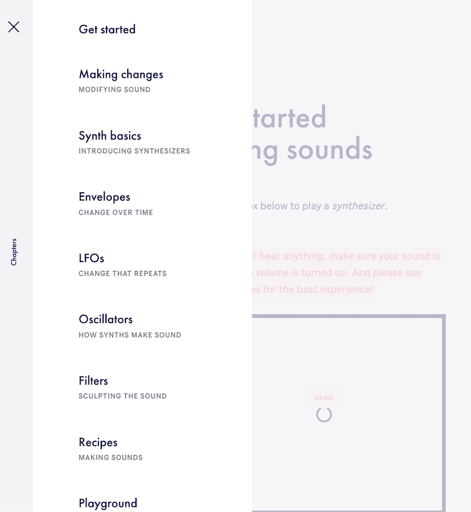
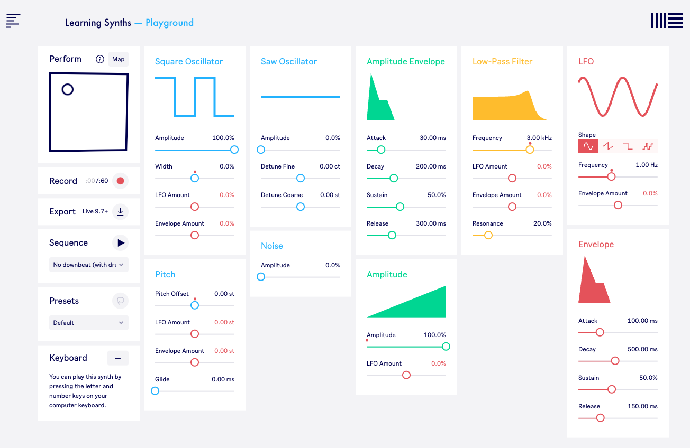

# Synthesing of Sound and Music

Materials for session on 29.11.22

## Overview
Today you will learn more about synthesing of sound and music. We will use three tools, all of them are using Cycling'74's MAX at their core. The tools are:
1. MAX/MSP core objects
2. MAX/MSP with BEAT modules (the modules are built with MAX/MSP, but the complexity is hidden and you only see the user interface to change the parameters as frequency, filter settings, and more.
3. Ableton's [Learning Synth](https://learningsynths.ableton.com/). The audio modules used on this website are also created with MAX.

## In More Detail
An easy way to learn about sound synthesis is to follow the learning path on [Learning Synth](https://learningsynths.ableton.com/).


#### Table of Content



Here is a list of all subjects covered. You can either go through the course page by page, or just skim through the course and choose on that menu the things you want to learn about. Please get an idea before you tackle the ```Recipes``` and ```Playground```. In these sections you can assemble/synthesise your own sounds.

#### The ```Playground``` ...
... also allows you to make an audio recording of your work and save the file on your computer.

<a target="_blank" href="https://learningsynths.ableton.com/en/playground)">
  
</a>


## Further Materials
- [Cycling'74 blog post about how to create the sound for the lightsaber](https://cycling74.com/forums/lightsaber-inspired-sound)
- [A History of Synths in Cinema: Recreating Famous Sounds with eDNA Earth](https://youtu.be/AyXP4dOQsG0)
- [Sound Clips out of Daily Life](https://www.soundsofchanges.eu/?s=police) - You can use these clips as a model to synthesise the (simple) sounds with the tools here available. Furthermore, you can download the wav files and then use them with the playlist~ object inside your patches.
- [Telephone - Change to dial service in 1936, video with some signals for telephones](https://laughingsquid.com/1936-att-introduction-to-rotary-dial-telephones/)
